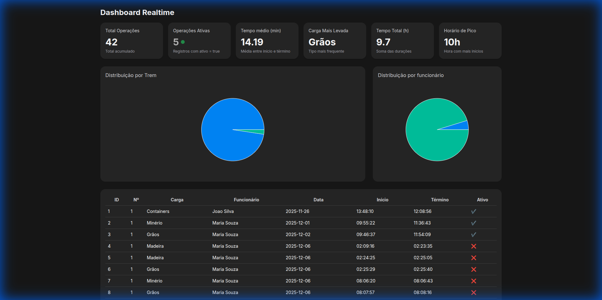

# Dashboard de Monitoramento Ferroviário em Tempo Real

> Trabalho de Conclusão de Curso (TCC) - Automação Industrial (2025)

Este projeto consiste em um dashboard interativo para monitoramento em tempo real de operações ferroviárias. O sistema consome dados de logs operacionais (`trem_log1`) e apresenta indicadores chave de desempenho (KPIs) e gráficos estatísticos para auxílio na tomada de decisão.



## 🚀 Funcionalidades

-   **Monitoramento em Tempo Real:** Atualização instantânea de dados via Supabase Realtime.
-   **KPIs Operacionais:** Visualização de Total de Operações, Operações Ativas, Tempo Médio, Carga Mais Levada, etc.
-   **Visualização de Dados:**
    -   Gráfico de Pizza: Distribuição por Trem.
    -   Gráfico de Pizza: Distribuição por Funcionário.
    -   Tabela detalhada com paginação e animações.
-   **Interface Moderna:** Design responsivo (Mobile/Desktop), Dark Mode e animações fluidas (`framer-motion`).

## 🛠️ Tecnologias Utilizadas

-   **Frontend:** [Next.js 14](https://nextjs.org/) (App Router), [React](https://react.dev/)
-   **Linguagem:** [TypeScript](https://www.typescriptlang.org/)
-   **Estilização:** [Tailwind CSS](https://tailwindcss.com/)
-   **Banco de Dados & Realtime:** [Supabase](https://supabase.com/)
-   **Gráficos:** [Recharts](https://recharts.org/)
-   **Animações:** [Framer Motion](https://www.framer.com/motion/)

## 📦 Como Rodar o Projeto

### Pré-requisitos

-   Node.js (v18+)
-   Conta no Supabase com a tabela `trem_log1` configurada.

### Instalação

1.  Clone o repositório:
    ```bash
    git clone https://github.com/FelipeAvelno/ts-dashboard-tcc.git
    cd ts-dashboard-tcc
    ```

2.  Instale as dependências:
    ```bash
    npm install
    ```

3.  Configure as variáveis de ambiente:
    Crie um arquivo `.env.local` na raiz do projeto e adicione suas credenciais do Supabase:
    ```env
    NEXT_PUBLIC_SUPABASE_URL=sua_url_do_supabase
    NEXT_PUBLIC_SUPABASE_ANON=sua_chave_anonima
    NEXT_PUBLIC_SUPABASE_TABLE=trem_log1
    ```

4.  Rode o servidor de desenvolvimento:
    ```bash
    npm run dev
    ```

5.  Acesse `http://localhost:3000/dashboard`.

## 🌐 Deploy

O projeto está configurado para deploy na [Vercel](https://vercel.com). Basta importar o repositório e configurar as variáveis de ambiente.

## 📄 Licença

Todos os direitos reservados. Este projeto é parte de um Trabalho de Conclusão de Curso (TCC) e não pode ser reproduzido ou distribuído sem autorização prévia do autor.
